# Pravenya Infrastructure Global - Architecture Diagram

This document shows the Azure resources created by this repository and their relationships.

## Architecture Overview

```mermaid
graph TB
    subgraph "Azure AD (Entra ID)"
        direction TB
        AG1[Security Group<br/>pravenya-admins]
        AG2[Security Group<br/>pravenya-devs]
        AG3[Security Group<br/>pravenya-viewers]
        
        APP1[App Registration<br/>pravenya-web]
        SP1[Service Principal<br/>pravenya-web]
        APP1 --> SP1
        
        APP2[App Registration<br/>pravenya-github-actions]
        SP2[Service Principal<br/>pravenya-github-actions]
        SECRET[Application Password<br/>GitHub Actions Secret]
        APP2 --> SP2
        APP2 --> SECRET
    end
    
    subgraph "Management Groups Hierarchy"
        direction TB
        ROOT[Management Group<br/>mg-pravenya-root]
        NONPROD[Management Group<br/>mg-pravenya-nonprod]
        PROD[Management Group<br/>mg-pravenya-prod]
        
        ROOT --> NONPROD
        ROOT --> PROD
    end
    
    subgraph "Subscriptions"
        direction TB
        SUB1[Subscription 1<br/>Non-Prod]
        SUB2[Subscription 2<br/>Non-Prod]
        SUB3[Subscription 3<br/>Prod]
        
        NONPROD --> SUB1
        NONPROD --> SUB2
        PROD --> SUB3
    end
    
    subgraph "Policies"
        direction TB
        PDEF[Policy Definition<br/>pravenya-require-tags<br/>Requires: Environment, Project, Owner tags]
        PASSIGN[Policy Assignment<br/>prv-req-tags]
        PDEF --> PASSIGN
    end
    
    subgraph "Role Assignments"
        direction TB
        RA1[Role Assignment<br/>GitHub Actions SP<br/>Contributor Role]
    end
    
    subgraph "GitHub Actions"
        direction TB
        GH[GitHub Actions Workflow<br/>Uses Service Principal]
        GH --> SP2
    end
    
    %% Relationships
    SP2 -->|Contributor Role| SUB1
    SP2 -->|Contributor Role| SUB2
    SP2 -->|Contributor Role| SUB3
    PASSIGN -->|Assigned to| SUB1
    PASSIGN -->|Assigned to| SUB2
    PASSIGN -->|Assigned to| SUB3
    
    %% Permissions
    SP2 -.->|Requires| PERM[Microsoft Graph API Permissions<br/>- Group.ReadWrite.All<br/>- Application.ReadWrite.All<br/>- Directory.ReadWrite.All]
    
    style AG1 fill:#e1f5ff
    style AG2 fill:#e1f5ff
    style AG3 fill:#e1f5ff
    style APP1 fill:#fff4e1
    style APP2 fill:#fff4e1
    style SP1 fill:#ffe1f5
    style SP2 fill:#ffe1f5
    style ROOT fill:#e8f5e9
    style NONPROD fill:#e8f5e9
    style PROD fill:#e8f5e9
    style PDEF fill:#f3e5f5
    style PASSIGN fill:#f3e5f5
    style RA1 fill:#fff9c4
    style PERM fill:#ffebee
```



## Resource Details

### 1. Management Groups

**Hierarchy:**
```
mg-pravenya-root (Root)
├── mg-pravenya-nonprod (Non-Production)
│   └── Subscriptions (Non-Prod subscriptions)
└── mg-pravenya-prod (Production)
    └── Subscriptions (Prod subscriptions)
```

**Resources:**
- `azurerm_management_group.root` - Root management group
- `azurerm_management_group.nonprod` - Non-production management group
- `azurerm_management_group.prod` - Production management group
- `azurerm_management_group_subscription_association.*` - Subscription associations

### 2. Entra ID (Azure AD) Resources

#### Security Groups
- **pravenya-admins** - Administrators for Pravenya organization
- **pravenya-devs** - Developers for Pravenya organization
- **pravenya-viewers** - Viewers for Pravenya organization

#### App Registrations
- **pravenya-web** - Web application registration
  - Redirect URI: `https://pravenya-web.azurestaticapps.net/`
  - Associated Service Principal: `pravenya-web`

- **pravenya-github-actions** - Service principal for GitHub Actions CI/CD
  - Associated Service Principal: `pravenya-github-actions`
  - Application Password: `GitHub Actions Secret` (1 year expiration)

### 3. Policies

**Policy Definition:**
- **Name:** `pravenya-require-tags`
- **Type:** Custom
- **Effect:** Deny
- **Requires Tags:**
  - `Environment`
  - `Project`
  - `Owner`

**Policy Assignment:**
- **Name:** `prv-req-tags`
- **Scope:** Subscription level (if `subscription_id` is provided)
- **Enforcement:** Enabled

### 4. Role Assignments

**GitHub Actions Service Principal:**
- **Role:** Contributor
- **Scope:** Subscription (if `subscription_id` is provided)
- **Purpose:** Allow GitHub Actions to manage Azure resources

### 5. Required Permissions

**For GitHub Actions Service Principal to manage Azure AD resources:**

The service principal needs Microsoft Graph API permissions:
- `Group.ReadWrite.All` - Read and write all groups
- `Application.ReadWrite.All` - Read and write all applications
- `Directory.ReadWrite.All` - Read and write directory data
- `User.ReadWrite.All` - Read and write all users (optional)

**Granted via:**
- Azure Portal → App registrations → API permissions
- Or using the `grant-azuread-permissions.sh` script

## Resource Dependencies

```
1. Management Groups (root → nonprod/prod)
   ↓
2. Subscriptions (associated to management groups)
   ↓
3. Entra ID Groups (admins, devs, viewers)
   ↓
4. App Registrations (pravenya-web, github-actions)
   ↓
5. Service Principals (created from app registrations)
   ↓
6. Application Password (for GitHub Actions SP)
   ↓
7. Role Assignments (GitHub Actions SP → Contributor)
   ↓
8. Policy Definition (require-tags)
   ↓
9. Policy Assignment (assigned to subscriptions)
```

## Deployment Flow

1. **Management Groups** are created first (root, then nonprod/prod)
2. **Subscriptions** are associated with management groups
3. **Entra ID Groups** are created (admins, devs, viewers)
4. **App Registrations** are created
5. **Service Principals** are created from app registrations
6. **Application Password** is created for GitHub Actions SP
7. **Role Assignments** grant permissions to service principals
8. **Policy Definition** is created
9. **Policy Assignment** applies the policy to subscriptions

## Outputs

The repository outputs:
- `entra_group_ids` - Object IDs of security groups
- `service_principal_id` - Pravenya Web service principal ID
- `app_registration_client_id` - Pravenya Web app client ID
- `github_actions_service_principal` - Complete GitHub Actions SP details (sensitive)
- `github_actions_client_id` - GitHub Actions SP client ID
- `github_actions_client_secret` - GitHub Actions SP client secret (sensitive)
- `management_group_ids` - Management group IDs

## Security Considerations

1. **Service Principal Permissions:**
   - GitHub Actions SP needs Contributor role on subscriptions
   - GitHub Actions SP needs Microsoft Graph API permissions for Azure AD management

2. **Policy Enforcement:**
   - All resources must have Environment, Project, and Owner tags
   - Policy is enforced at subscription level

3. **Secret Management:**
   - Application passwords are stored in Terraform state (sensitive)
   - Secrets should be stored in GitHub Secrets for CI/CD

4. **Access Control:**
   - Security groups (admins, devs, viewers) can be used for role assignments
   - Management group hierarchy provides governance structure

